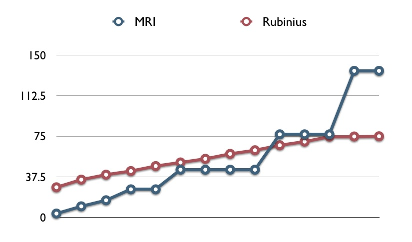
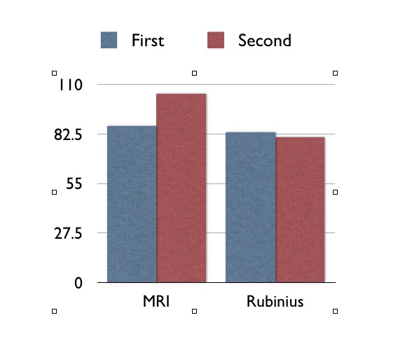

!SLIDE main_topic

# Garbage Collector #

!SLIDE bullets incremental

* generational
* fast allocation
* fast collection
* steady state

!SLIDE smaller

    @@@ ruby
    class Link
      attr_accessor :left, :right

      def initialize(left=nil, right=nil)
        @left = left
        @right = right
      end
    end

!SLIDE smaller

    @@@ Ruby
    require "benchmark"
    require "link"

    def work
      tail = Link.new

      100_000_000.times do |i|
        link = Link.new

        if i % 100 == 0
          chain tail, link
          tail = link
        end

        report if i % 10_000_000 == 0
      end
    end

    Benchmark.bmbm do |x|
      x.report do
        work
      end
    end

!SLIDE smaller

    @@@ Ruby
    def report
      puts `ps -p #{Process.pid} -o rss=''`
    end

    def chain(left, right)
      left.right = right
      right.left = left
    end

!SLIDE commandline small

    $ ruby -v -I. bm_create.rb
    ruby 1.9.2p180 (2011-02-18 revision 30909) [x86_64-darwin10.7.0]
    Rehearsal ------------------------------------
     86.500000   0.360000  86.900000 ( 86.927516)
    -------------------------- total: 86.900000sec

           user     system      total        real
    103.790000   0.750000 104.590000 (104.635425)

!SLIDE commandline small

    $ rbx -v -I. bm_create.rb
    rubinius 2.0.0dev (1.8.7 60b004a2 yyyy-mm-dd JI) [x86_64-apple-darwin10.7.0]
    Rehearsal ------------------------------------
     82.751259   0.220694  83.015615 ( 83.229629)
    -------------------------- total: 83.015615sec

           user     system      total        real
     80.182678   0.164082  80.390487 ( 80.534252)

!SLIDE center

!SLIDE center

!SLIDE commandline smaller

    $ rbx -Xprofile -v -I. bm_create.rb
    rubinius 2.0.0dev (1.8.7 60b004a2 yyyy-mm-dd JI) [x86_64-apple-darwin10.7.0]
    Thread 1: total running time: 661.87429089s

      %   cumulative   self                self     total
     time   seconds   seconds      calls  ms/call  ms/call  name
    ------------------------------------------------------------
      61.02  543.62    403.89  200000000     0.00     0.00  Object::work<16> {}
      17.12  660.43    113.32          2 56661.61 330215.82  Integer#times
       8.56   53.17     56.66  200000002     0.00     0.00  Link#initialize
       8.48   49.42     56.16  400000006     0.00     0.00  Fixnum#%
       4.01   26.08     26.51  200000541     0.00     0.00  Class#allocate
       0.40    2.68      2.68       5676     0.47     0.47  GC.collect_young
       0.21    1.41      1.41          1  1410.91  1410.91  Rubinius::Tooling.disable
       0.10    0.59      0.63    2000000     0.00     0.00  Object#chain
       0.06    0.40      0.40          5    79.28    79.28  GC.collect_mature
       0.02    0.14      0.14         20     7.07     7.03  Process.replace
       0.00    0.03      0.03        104     0.27     0.27  Rubinius::Tuple#==
       0.00    0.01      0.01         11     0.93     1.13  Rubinius::Sprinter::Builder#parse
       0.00    0.03      0.01         20     0.36     1.68  Process.wait2
       0.00    0.01      0.01          9     0.76     0.76  Rubinius::Sprinter::Builder::FloatAtom#bytecode
       0.00    0.02      0.00         11     0.39     1.47  Module#dynamic_method
       0.00  660.45      0.00        154     0.02  4288.65  Array#each

!SLIDE

# packed object layout

!SLIDE commandline incremental

    $ rbx -rlink -e 'p Rubinius.memory_size(Link.new)'

    40

    $ rbx -Xgc.autopack=false -rlink -e '...'

    152

    $ rbx -rlink -e 'p Rubinius.memory_size(Hash.new)'

    80

    $ rbx -Xgc.autopack=false -rlink -e '...'

    152
