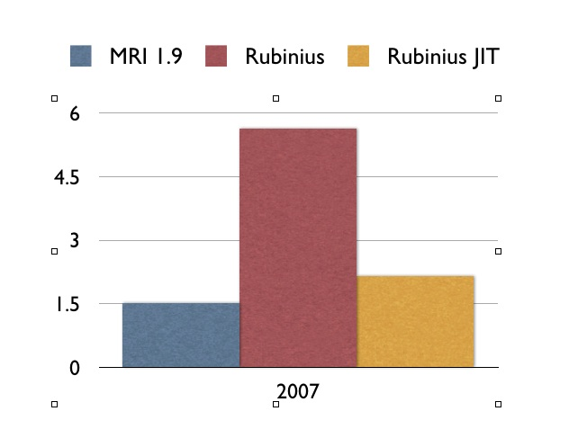

!SLIDE main_topic

# JIT Compiler #

!SLIDE bullets incremental

* custom
* Ruby
* LLVM
* concurrent

!SLIDE small

    @@@ Ruby
    require "benchmark"

    def find(array)
      100_000.times do
        array.select { |x| x > 5 }
      end
    end

    Benchmark.bmbm do |x|
      array = Array.new(100) { |i| rand(i) }

      x.report do
        find array
      end
    end

!SLIDE center

!SLIDE small

    @@@ Ruby
    def find_all(array)
      array.select { |x| x > 5 }
    end

    array = Array.new(100) { |i| rand(i) }

    20_000.times do
      find_all array
    end

!SLIDE commandline smaller

    $ rbx -Xjit.call_til_compile=10000 -Xjit.dump_code=4 jit.rb

    [[[ JIT Machine Code: _X_Object#find_all@7 ]]]
    0x102caa3f0  push %rbp               
    0x102caa3f1  mov %rsp, %rbp          
    0x102caa3f4  push %r14               
    0x102caa3f6  push %rbx               
    0x102caa3f7  subq $0xd0, %rsp        
    0x102caa3fe  cmp $0x1, 0x18(%r8)     
    0x102caa403  mov %rdi, %rbx          
    0x102caa406  jz 0x38                  ; 0x102caa428
    0x102caa40c  mov $0x1, %ecx          
    0x102caa411  mov $0x1002399d0, %rax   ; rbx_arg_error
    0x102caa41b  mov %rbx, %rdi          
    0x102caa41e  mov %r8, %rdx           
    0x102caa421  callq *%rax             
    0x102caa423  jmp 0x25a                ; 0x102caa64a
    0x102caa428  mov %rsi, -0x70(%rbp)   
    0x102caa42c  mov %r8, -0x30(%rbp)    
    
