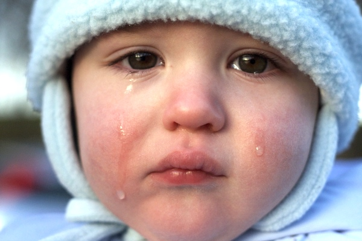

!SLIDE single-point-intro

# Summary

!SLIDE single-point

# Ruby is at a critical point

!SLIDE single-point

# _I did not change Ruby_

!SLIDE single-point

# Available in
# 1.8 and 1.9

!SLIDE single-point

# Respect business that bet on Ruby

!SLIDE center basic-image sad

http://forums.steves-digicams.com/people-photos/150189-sad-little-boy-advice-re-post-production-required.html#b

!SLIDE single-point

# Help Ruby
# help you

!SLIDE

# github.com/rubinius/rubinius

!SLIDE

# github.com/brixen/nikita

!SLIDE small

# github.com/brixen/presentations

!SLIDE single-point

# Thank you
